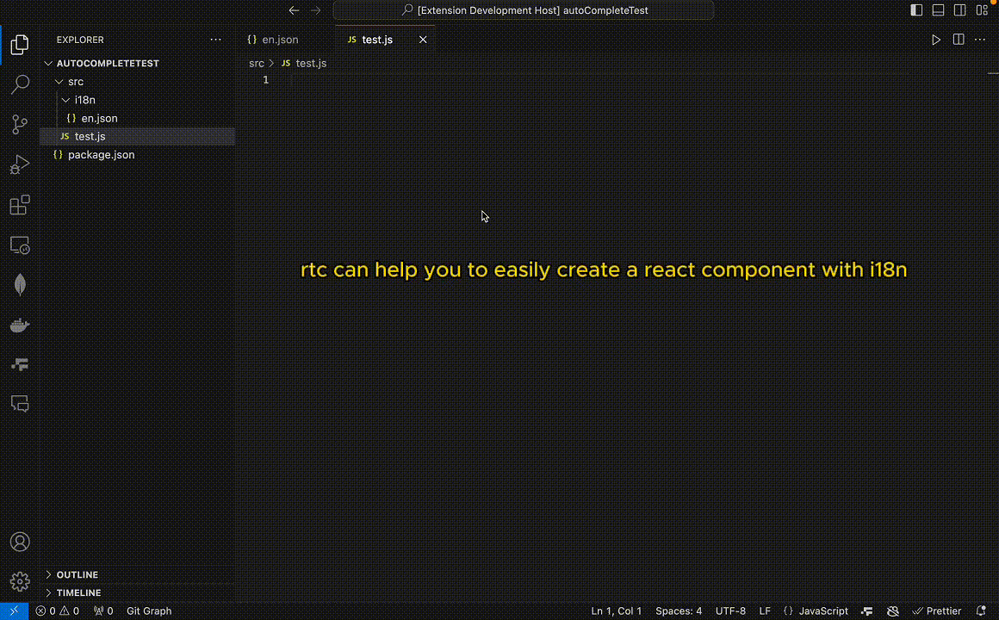
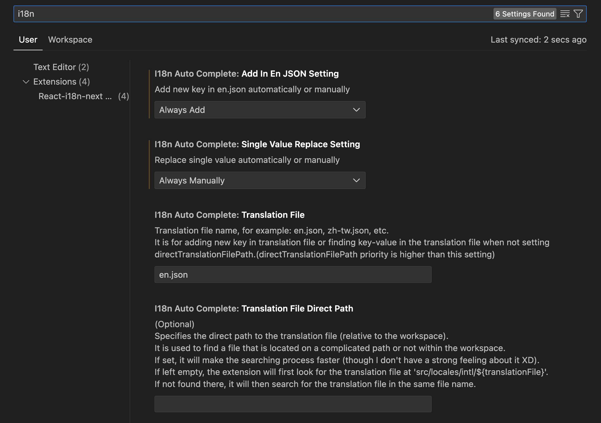

# intl-18n-autoComplete README
If you like it, please give it a star ⭐ to let more people know,thx~.

## Features



### Snippets Included

| Snippet | Purpose                     | Description                                                                                                    |
| ------- | --------------------------- | -------------------------------------------------------------------------------------------------------------- |
| `rtc`   | i18n Component              | Simplifies initializing an i18n React component.                                                               |
| `ut`   | react-i18n-next format Translation       | Inserts `const { t, i18n } = useTranslation();` to simplify using the react-i18n-next translation function in React components.          |
| `ft`    | add react-i18n-next translation           | Inserts `t("$1")` to simplify invoking the react-i18n-next translation function with a given message ID. |
| `ftx`   | add react-i18n-next translation in jsx {} | Inserts `{t("$1")}` for embedding the react-i18n-next translation function within JSX code.              |

### Extension Included

This extension provides a command `extension.findi18nkey` that performs the following steps:

1. Retrieves the selected text in the editor.
2. Checks for the presence of an `en.json` file in the directory.

```
recommand folder structure(Non-essential)
   /src
      /locales
         /en.json
```

> Please be aware that if your Visual Studio Code workspace includes multiple project directories, you might inadvertently access the wrong en.json file. This is because the extension uses workspaceRoot to search for en.json. The search function might locate and use an en.json file from a different project folder within the same workspace. Therefore, it is advisable to use a single project within a workspace. Thank you.

3. Parses the JSON file and searches for keys corresponding to the selected text.

4. If a matching key is found, it replaces the selected text with the appropriate `t` function containing the key.

5. Shows information messages in case of errors or when no key is found.

## Usage

To use the extension:

1. Open a file in Visual Studio Code.

2. Select the text you want to find a key for.

3. Run the command `Find i18n Key` either by pressing `Ctrl+Shift+P` to open the command palette and typing `Find i18n Key`, or by clicking `alt(option)+t` on the selected text.

4. If a matching key is found, the selected text will be replaced with the `t` function containing the key.

5. If multiple keys have the same value, a quick pick will appear for you to select the correct key.

6. You can choose whether to add the key to the `en.json` file or not using the preference option.

7. If you prefer, you can manually choose or enter the key instead of replacing it automatically.

8. The extension now trims leading and trailing whitespace from the selected text and `en.json` text when comparing.

9. To reset the preference, you can use the resetIntlPreference command in the command palette

## Known Issues

- There is a conflict with the Babel JavaScript extension, causing the snippets to fail when the file is considered as babel-javascript by Visual Studio Code.

- The extension may encounter errors when trying to find the en.json file in multiple project directories.

## Release Notes 1.0.1

- Includes snippets for simplifying intl React component initialization and formatMessage usage.
- Allows users to find keys in an `en.json` file based on selected text and replace it with the corresponding `t("$1")` function.
- Fixed the issue that required a specific path.
- Fixed the issue that enter empty string or press ESC will add undefined in translation file.
- Added a quick pick for selecting the correct key when multiple keys have the same value.
- Added an option to manually enter text when the selected value cannot be found in en.json.
- Added a preference option to choose whether to add the key to en.json or not.
- Added preference option to replace single keys with the same value or manually choose/enter the key.
- Implemented the trim() function to remove leading and trailing whitespace from the selected text and en.json text when comparing.
- Add config for change translation file.Not only for en.json, but also for other language files.
- Add specifies the direct path to the translation file (relative to the workspace), which can be useful when the file is not in the default location, such as in a subfolder or a different project directory.
- You can set the preference by I18n Auto Complete Setting
  
